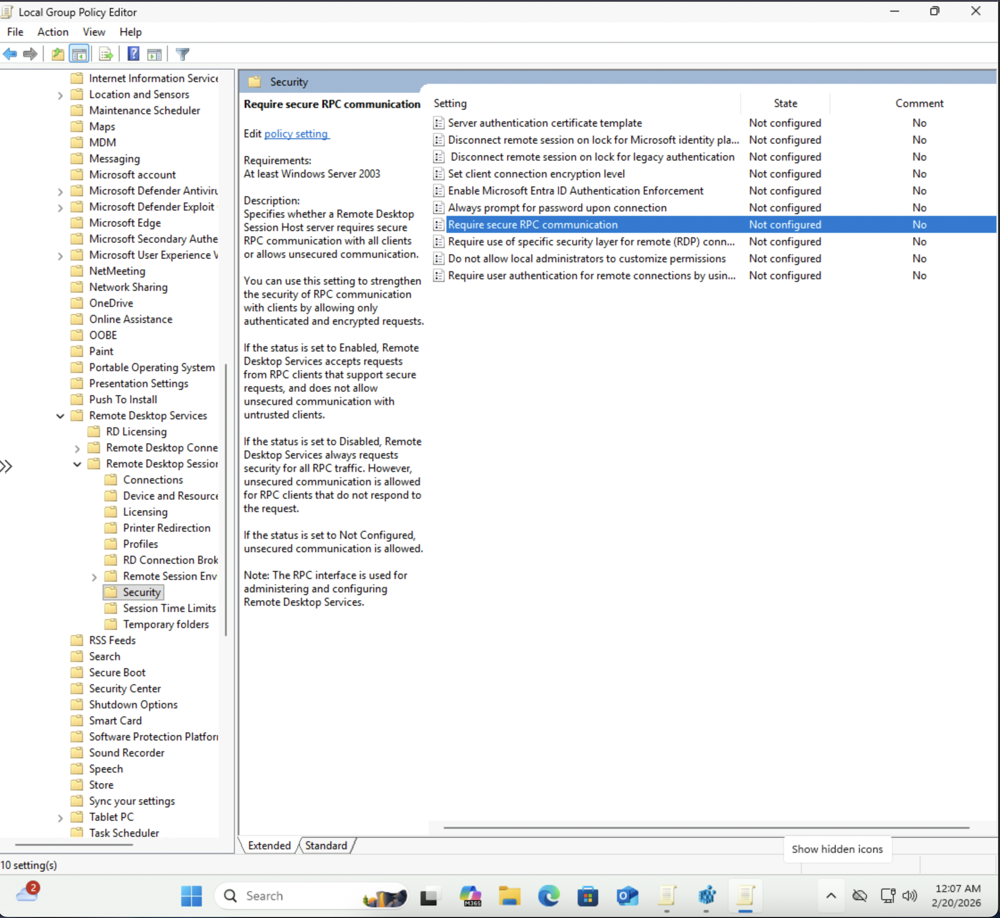
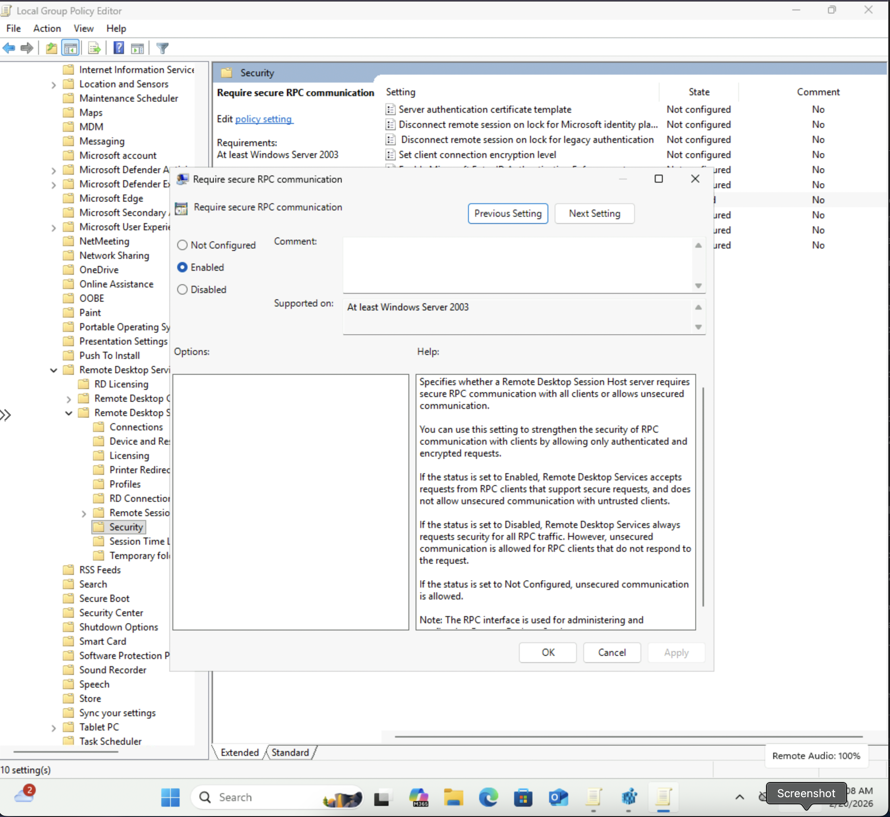
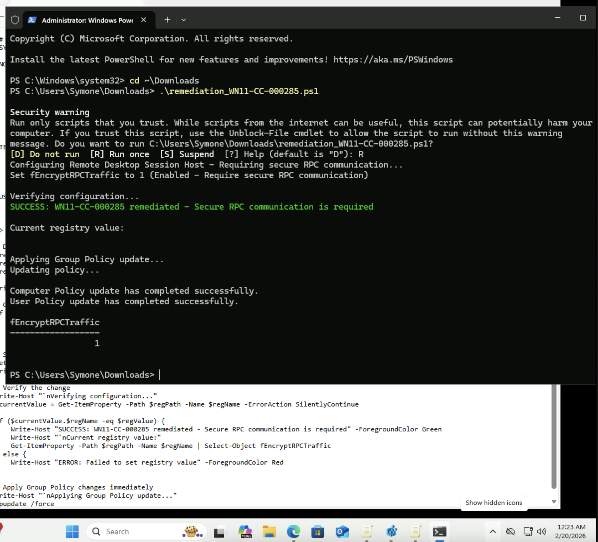
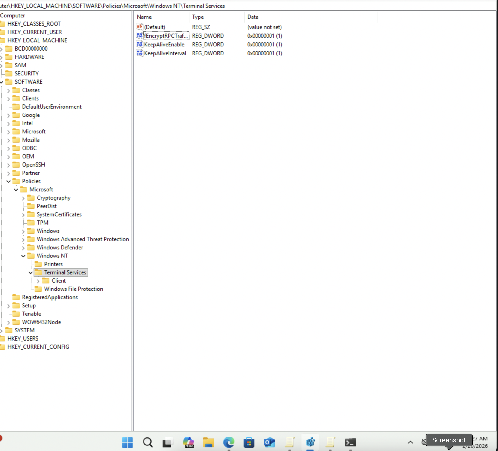
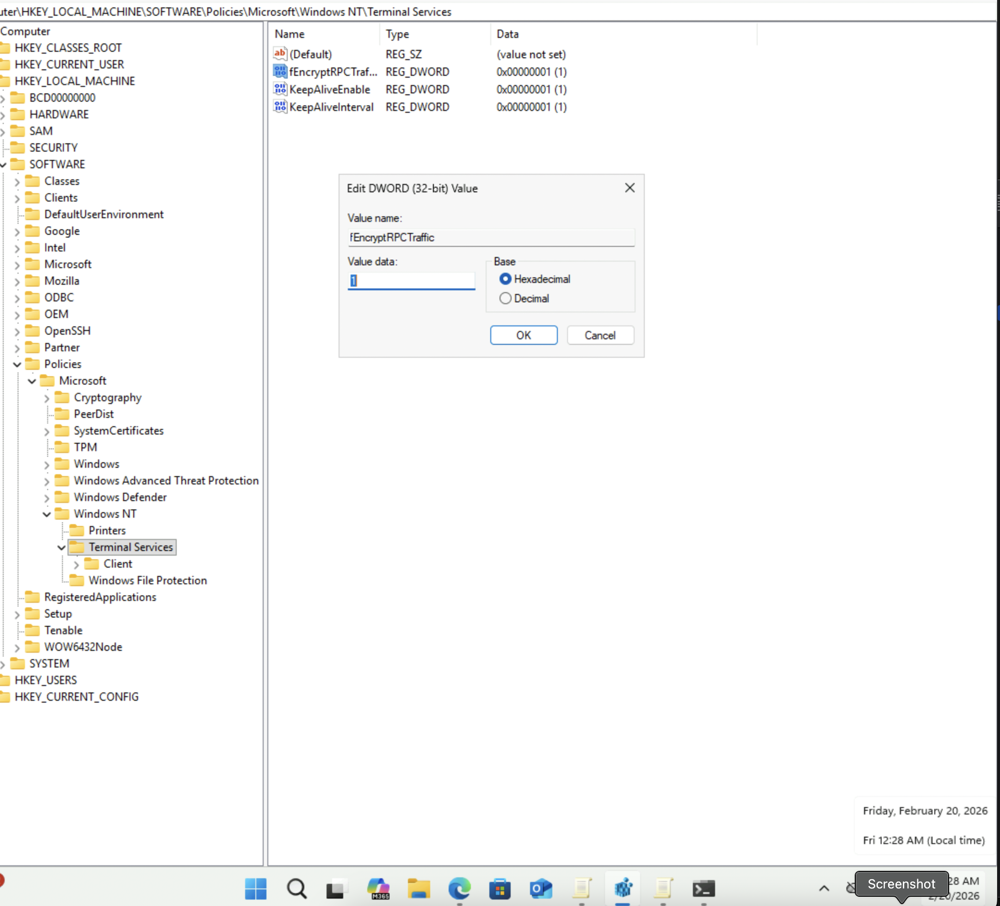

# Windows STIG WN11-CC-000285 Remediation
## Overview
This repository contains remediation for STIG vulnerability WN11-CC-000285: "The Remote Desktop Session Host must require secure RPC communications."
## Vulnerability Details
- **STIG-ID**: WN11-CC-000285
- **Vuln-ID**: V-253405
- **Severity**: CAT II
- **Description**: Secure RPC communication enhances security by ensuring only authenticated and encrypted requests are accepted from RPC clients. When set to Not Configured or Disabled, unsecured RPC communication is allowed, leaving the system vulnerable to interception and unauthorized access via Remote Desktop Services.
## Remediation Methods
### Automated (PowerShell Script)
Run the `remediation_WN11-CC-000285.ps1` script as Administrator to automatically require secure RPC communication.
**To run:**
```powershell
PS C:\> .\remediation_WN11-CC-000285.ps1
```
### Manual (Group Policy Editor)
1. Open Local Group Policy Editor (`gpedit.msc`)
2. Navigate to: `Computer Configuration` → `Administrative Templates` → `Windows Components` → `Remote Desktop Services` → `Remote Desktop Session Host` → `Security`
3. Double-click **"Require secure RPC communication"**
4. Select **"Enabled"**
5. Click **OK**
6. Open PowerShell as Administrator and run: `gpupdate /force`
7. Verify with: `Get-ItemProperty -Path "HKLM:\SOFTWARE\Policies\Microsoft\Windows NT\Terminal Services" -Name "fEncryptRPCTraffic"`
## Screenshots
### Before - Policy Not Configured

### During - Policy Properties Open

### After - Policy Enabled

### Group Policy Force Update

### PowerShell Automated Remediation Success

### Registry Verification - Key Present

### Registry Verification - Value Confirmed

## Testing Information
- **Tested By**: Symone-Marie Priester
- **Date Tested**: February 19, 2026
- **System**: Windows 11 (Version 10.0.26200.7623)
- **PowerShell Version**: 5.1
- **Methods**: Both automated (PowerShell) and manual (Group Policy Editor)
## Repository Structure
```
├── remediation_WN11-CC-000285.ps1       # PowerShell remediation script
├── RequireSecureRPC.png                 # During - policy properties open
├── RequireSecureRPC_NotConfigured.png   # Before - policy not configured
├── RequireSecureRPC_Enabled.png         # After - policy enabled
├── gpupdate_forceWN11-CC-000285.png     # Group Policy force update
├── RemediationScriptFileRan.png         # PowerShell remediation success
├── fEncryptRPCTraffic.png               # Registry key present
├── fEncryptRPCTraffic_1.png             # Registry value confirmed
└── README.md                            # This file
```
## Author
**Symone-Marie Priester**
- LinkedIn: [linkedin.com/in/symone-mariepriester](https://linkedin.com/in/symone-mariepriester)
- GitHub: [github.com/Symone-Marie](https://github.com/Symone-Marie)
